# PowerBI BI 開発ポートフォリオ — 品質分析ダッシュボード

**目的:** 架空の品質分析装置を業務想定として PowerBI によるデータ分析基盤の構築手法を示す技術実証資料。BI エンジニアとして実務で担う各工程の実装内容を記録する。

**対象データ:** 品質分析装置の計測出力（ダミー）— 1,100 件 / 100 指標 / 50 社

**構成:** データ取込（PowerQuery）・データモデル（スタースキーマ）・集計ロジック（DAX 20 本超）・Python 統合・ダッシュボード（7 画面）

> **Note:** 本リポジトリは技術デモンストレーション用に独立して構築したものです。データはすべてダミーです。

---

## 構築・実装した内容

- **データ整形**: 複数の CSV ファイルを結合・変換し、分析に使えるかたちに整形した（PowerQuery）
- **データモデル設計**: 指標・顧客・地域などを整理したデータ構造（スタースキーマ）を設計した
- **集計ロジック実装**: 平均・ばらつき・動的フィルタ・欠損補完などの計算を数式で実装した（DAX）
- **機械学習との統合**: Python によるクラスタリング・次元削減の結果をダッシュボードに組み込んだ
- **ダッシュボード設計**: KPI・分布・地域別・品質モニタリングなど、目的別に 7 画面を設計・実装した

---

## 担当できる作業領域

全工程を把握しているため、作業指示書・要件定義書の作成や打ち合わせでの仕様すり合わせにも対応できる。

- **データ取込・ETL**: PowerQuery 5 本。ソース読み込み → 型変換 → フィルタ → 列リネーム → テーブル結合を一通り実装済み
- **データモデリング**: スタースキーマ設計（ファクト 1 + ディメンション 4）。PowerQuery で `customer_id` / `region` を結合しリレーション定義
- **DAX メジャー開発**: 加重平均・CV%（統計）/ `SELECTEDVALUE + CALCULATE + FILTER`（動的クロス集計）/ `SWITCH + ISBLANK`（優先順位フォールバック）など 20 本超
- **Python 統合**: PowerQuery 内で scikit-learn を実行。PCA・K-means の結果列をデータモデルに統合しビジュアルで直接利用
- **ダッシュボード設計**: 7 ページ構成。スライサー連動・Python ビジュアル（`matplotlib`・`twinx` 二軸）・カスタムビジュアル（箱ひげ図）

> `quality_analysis.ipynb` は pbix を直接公開できないため、ダッシュボード上の分析を Python で再現した補助資料。メインの成果物はデータモデル・DAX・PowerQuery にある。

---

## ダッシュボード

### KPI サマリー

サンプル種別ごとに計測値 A・B・C・個数を一画面で比較。スライサー連動で min / median / mean / max を切り替えて確認できる。

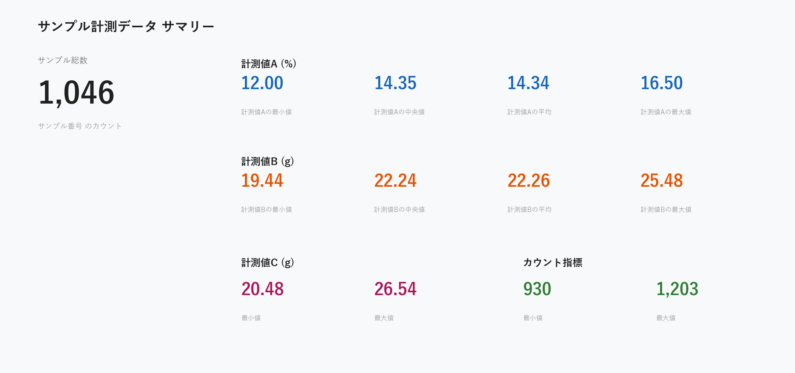

---

### 計測値分布（ヒストグラム 4 面）

「計測値のばらつきはどの指標で大きいか」をサンプル種別単位で確認。4 指標を同一スライサーで連動フィルタ。

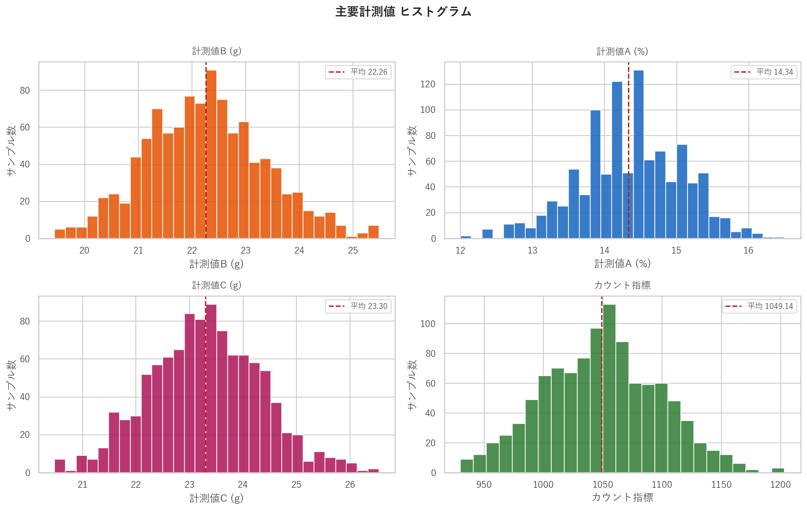

---

### 多系列散布図

「計測値 A・B・C と個数の時系列上の関係」を二軸で同時表示。Python ビジュアル（`matplotlib`・`twinx`）で実装。

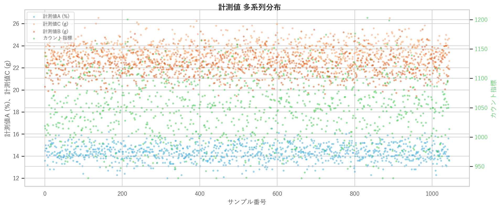

---

### データ品質モニタリング

「どの顧客のデータに記録漏れが多いか」を可視化。サンプル種別・日付・ID などの記録有無比率を積み上げ棒グラフで表示。

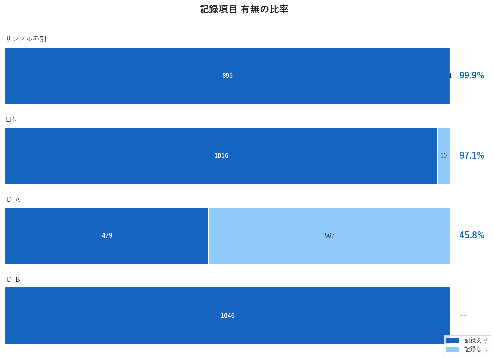

---

### 地域別分布

「どの地域に顧客が集中しているか」を 4 階層（東西 → 地方 → 地域区分 → 県）の地図で確認。

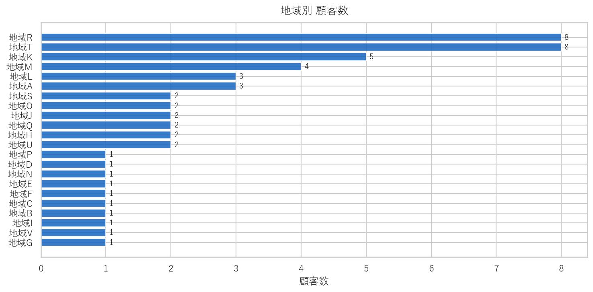

---

### PCA + K-means クラスタリング

「品質指標 100 次元のサンプルはどのような群に分かれるか」を 2 次元で可視化。PowerQuery 内の Python スクリプトで生成した PC1 / PC2 / Cluster をバブルチャートで表示。

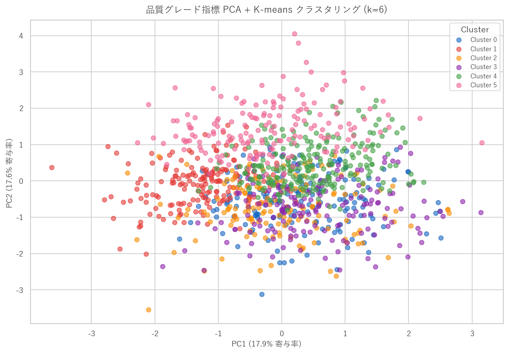

---

### 箱ひげ図（サンプル種別比較）

「サンプル種別間で計測値の分布にどれだけ差があるか」をカスタムビジュアルで比較。

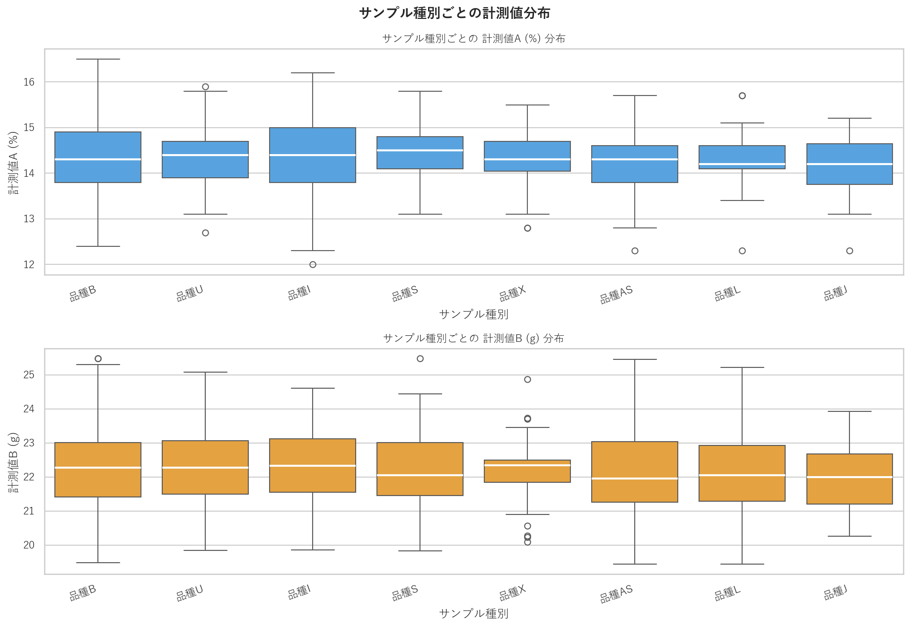

---

## データモデル

`品質分析装置データ.csv` をファクトテーブルとする 5 テーブルのスタースキーマ。

```text
                             ┌─ 分析装置出力_詳細.csv  (1:1)  Cluster / PC1 / PC2
                             ├─ サンプル情報.csv       (1:1)  サンプル受付情報
品質分析装置データ.csv ──────┤
    (ファクト中心)           ├─ 顧客マスタ.csv         (多:1) customer_id で結合
                             └─ 地域マスタ            (多:1) region で結合 ※PowerBI 内部
                                                             東西 > 地方 > 地域区分 > 県（4 階層）
```

---

## 技術詳細

### PowerQuery — データ取込・加工

クエリ 5 本でデータ統合・変換を実施。全クエリ共通の標準ステップ:

- ソース読み込み → ヘッダー昇格 → 型変換 → フィルタ → 列リネーム

`分析装置出力_詳細.csv` のみ、PowerQuery 内で Python スクリプトを実行し 100 指標から次元削減・クラスタリング:

```python
from sklearn.decomposition import PCA
from sklearn.cluster import KMeans

pca = PCA(n_components=2)
pcs = pca.fit_transform(X)          # → PC1, PC2

km = KMeans(n_clusters=6, n_init=10)
clusters = km.fit_predict(X)        # → Cluster (0–5)
```

出力列 `Cluster` / `PC1` / `PC2` をデータモデルに統合し、ビジュアル側でそのまま利用。

---

### DAX メジャー

#### 統計メジャー

```dax
計測値B DW =
AVERAGEX('品質分析装置データ', '品質分析装置データ'[計測値B] * '品質分析装置データ'[計測値C])

計測値A CV% =
DIVIDE(
    STDEV.P('品質分析装置データ'[計測値A]),
    AVERAGE('品質分析装置データ'[計測値A])
)
```

#### 動的クロステーブル集計

地図ビジュアルの選択状態を `SELECTEDVALUE` で捕捉し、`CALCULATE + FILTER` でクロステーブル集計:

```dax
地域別種別数 =
VAR SelectedValue = SELECTEDVALUE('顧客マスタ'[region])
RETURN
    CALCULATE(
        DISTINCTCOUNT('品質分析装置データ'[サンプル種別]),
        FILTER('顧客マスタ', '顧客マスタ'[region] = SelectedValue)
    )
```

#### フォールバック計算列

3 列の優先順位で欠損データを補完:

```dax
サンプル種別 =
VAR v1 = '品質分析装置データ'[サンプル種別]
VAR v2 = '品質分析装置データ'[サンプル名推測]
VAR v3 = '品質分析装置データ'[サンプル名]
RETURN SWITCH(TRUE(),
    NOT(ISBLANK(v1)), v1,
    NOT(ISBLANK(v2)), v2,
    NOT(ISBLANK(v3)), v3,
    BLANK()
)
```

その他: `種別あり比率` / `日付あり比率` / `ID_Aあり比率` / `計測値B/計測値A` など 20 本超。

---

## Python 分析（補助資料）

pbix を直接公開できないため、ダッシュボード上の分析を Python で再現した補足資料として [`quality_analysis.ipynb`](quality_analysis.ipynb) を掲載。

### 品質グレード構成比 / 主要指標分布

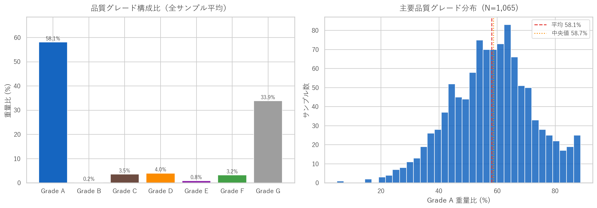

Grade A 平均 58.1% / Grade G 33.9%。

### 計測値 A 分析

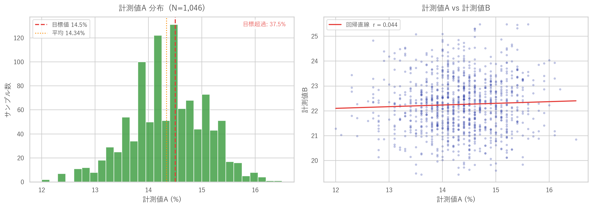

計測値 A 平均 14.34%（目標値 14.5%）。計測値 A vs 計測値 B: r = 0.044。

### 品質指標 相関マトリクス

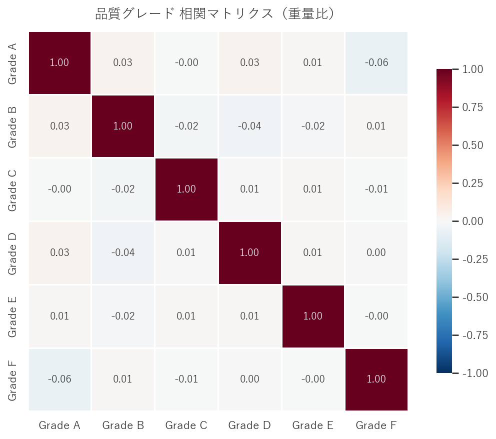

Grade A vs Grade F: r = −0.06。

### 顧客規模分布

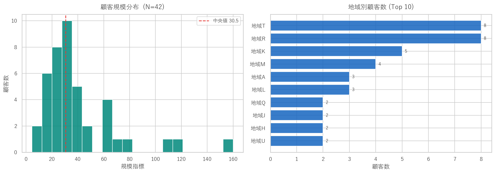

---

## ファイル構成

- `quality_analysis.ipynb` — ダッシュボード分析の Python 再現（補助資料）
- `generate_dashboard_images.py` — ダッシュボード相当グラフ生成スクリプト
- `分析装置出力_詳細.csv` — 品質分析装置出力（匿名化済み・1,100 件・100 指標）
- `品質分析装置データ.csv` — 基本計測値（計測値 A・B・C）
- `サンプル情報.csv` — サンプル受付情報
- `顧客マスタ.csv` — 顧客・規模・地域データ
